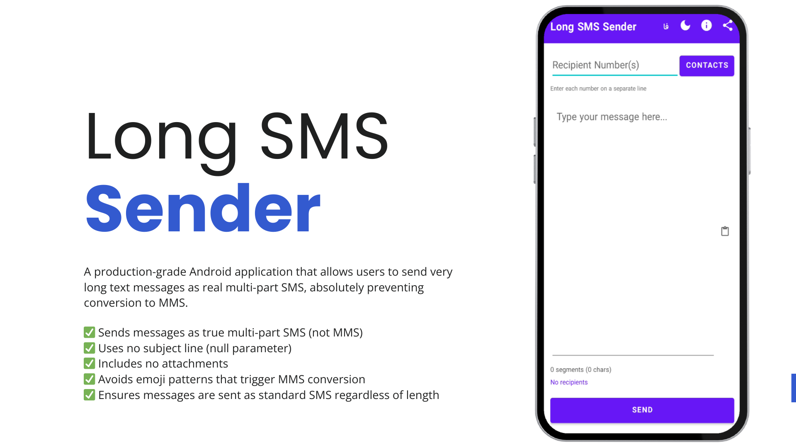

# ارسال پیامک بلند | Long SMS Sender

[🇺🇸 English](README.md) | [🇮🇷 فارسی](README.fa.md)



یک برنامه اندروید حرفه‌ای که به کاربران امکان ارسال پیامک‌های بسیار بلند به صورت پیامک چندبخشی واقعی را می‌دهد و **به طور کامل از تبدیل به MMS جلوگیری می‌کند**.

## 📱 این برنامه چه می‌کند؟

ارسال پیامک بلند به شما امکان می‌دهد:
- پیامک‌های **با طول نامحدود** را به صورت **چندبخشی** ارسال کنید
- از **تبدیل خودکار به MMS** که اپراتورها اغلب انجام می‌دهند جلوگیری کنید
- گیرندگان را از مخاطبین انتخاب کنید یا شماره تلفن را دستی وارد کنید
- به یک یا چند گیرنده با تأیید ارسال کنید
- شمارشگر بخش‌های پیامک به صورت لحظه‌ای
- پشتیبانی کامل از زبان فارسی و انگلیسی
- پشتیبانی از حالت تاریک

## 🛡️ چرا از تبدیل MMS جلوگیری می‌کند؟

این برنامه از **`SmsManager.sendMultipartTextMessage()`** استفاده می‌کند که:
- ✅ پیام‌ها را به صورت **پیامک چندبخشی واقعی** ارسال می‌کند (نه MMS)
- ✅ از **بدون خط موضوع** استفاده می‌کند (پارامتر null)
- ✅ **هیچ ضمیمه‌ای** ندارد
- ✅ از الگوهای ایموجی که باعث تبدیل MMS می‌شوند اجتناب می‌کند
- ✅ اطمینان می‌دهد که پیام‌ها به صورت **پیامک استاندارد** ارسال می‌شوند، صرف نظر از طول

برخلاف برنامه‌های پیام‌رسانی پیش‌فرض که پیام‌های بلند را به MMS تبدیل می‌کنند (که هزینه بیشتری دارد و ممکن است توسط همه اپراتورها پشتیبانی نشود)، این برنامه تضمین می‌کند که پیام‌های شما به صورت SMS ارسال شوند.

## 🔒 سیاست حریم خصوصی

**این برنامه هیچ داده شخصی را جمع‌آوری، ذخیره یا انتقال نمی‌دهد.**

- ✅ **بدون نیاز به مجوز اینترنت** - برنامه کاملاً آفلاین کار می‌کند
- ✅ بدون تجزیه و تحلیل یا ردیابی
- ✅ بدون تبلیغات
- ✅ بدون جمع‌آوری داده
- ✅ تمام پیامک‌ها مستقیماً از دستگاه شما ارسال می‌شوند
- ✅ داده‌های مخاطب فقط به صورت محلی برای انتخاب گیرنده استفاده می‌شود
- ✅ هیچ داده‌ای در سرورهای خارجی ذخیره نمی‌شود
- ✅ تمام اطلاعات در دیالوگ درباره برنامه به صورت داخلی است (بدون درخواست شبکه)

حریم خصوصی شما اولویت ماست. تمام عملیات به صورت محلی روی دستگاه شما انجام می‌شود.

## 🔐 توضیح مجوزها

این برنامه فقط به **دو مجوز** نیاز دارد:

### 1. مجوز `SEND_SMS`
- **چرا**: برای ارسال پیامک‌ها لازم است
- **چه زمانی استفاده می‌شود**: فقط وقتی که دکمه "ارسال" را فشار می‌دهید
- **چه کاری انجام می‌دهد**: پیامک را مستقیماً از دستگاه شما ارسال می‌کند
- **حریم خصوصی**: هیچ داده‌ای جمع‌آوری یا انتقال داده نمی‌شود

### 2. مجوز `READ_CONTACTS`
- **چرا**: برای انتخاب گیرندگان از لیست مخاطبین شما
- **چه زمانی استفاده می‌شود**: فقط وقتی که "بارگذاری مخاطبین" را فشار می‌دهید
- **چه کاری انجام می‌دهد**: نام‌ها و شماره تلفن‌های مخاطب را به صورت محلی می‌خواند
- **حریم خصوصی**: داده‌های مخاطب هرگز دستگاه شما را ترک نمی‌کند

هر دو مجوز در زمان اجرا با توضیحات واضح درخواست می‌شوند. می‌توانید مجوزها را رد کنید و همچنان از برنامه با وارد کردن دستی شماره تلفن استفاده کنید.

## 🏗️ نحوه ساخت

### پیش‌نیازها
- Android Studio Hedgehog (2023.1.1) یا بالاتر
- JDK 17 یا بالاتر
- Android SDK 34
- Gradle 8.2+

### مراحل ساخت

1. **کلون کردن مخزن**:
   ```bash
   git clone https://github.com/mostafaafrouzi/long-sms-sender.git
   cd long-sms-sender
   ```

2. **باز کردن در Android Studio**:
   - Android Studio را باز کنید
   - "Open an Existing Project" را انتخاب کنید
   - به دایرکتوری کلون شده بروید

3. **ساخت پروژه**:
   ```bash
   ./gradlew assembleDebug
   ```
   یا از منوی Build در Android Studio استفاده کنید: Build → Build Bundle(s) / APK(s) → Build APK(s)

4. **یافتن APK**:
   - APK دیباگ: `app/build/outputs/apk/debug/app-debug.apk`
   - APK انتشار: `app/build/outputs/apk/release/app-release.apk`

### ساخت APK انتشار

برای ساخت نسخه انتشار، باید امضای دیجیتال را پیکربندی کنید:

1. ایجاد keystore (اگر ندارید):
   ```bash
   keytool -genkey -v -keystore my-release-key.jks -keyalg RSA -keysize 2048 -validity 10000 -alias my-key-alias
   ```

2. ایجاد `keystore.properties` در ریشه پروژه:
   ```properties
   storeFile=my-release-key.jks
   storePassword=رمز-ذخیره-شما
   keyAlias=my-key-alias
   keyPassword=رمز-کلید-شما
   ```

3. ساخت نسخه امضا شده:
   ```bash
   ./gradlew assembleRelease
   ```

## 📥 نحوه نصب

### از GitHub Releases (توصیه می‌شود)

1. به [Releases](https://github.com/mostafaafrouzi/long-sms-sender/releases) بروید
2. آخرین فایل APK را دانلود کنید
3. روی دستگاه اندروید خود:
   - "نصب از منابع ناشناخته" را در تنظیمات فعال کنید
   - فایل APK دانلود شده را باز کنید
   - دستورالعمل‌های نصب را دنبال کنید

### از منبع

1. APK را بسازید (به [نحوه ساخت](#-نحوه-ساخت) مراجعه کنید)
2. APK را به دستگاه اندروید خود منتقل کنید
3. با همان روش بالا نصب کنید

### نیازمندی‌ها

- اندروید 6.0 (API 23) یا بالاتر
- قابلیت ارسال SMS (نیاز به سیم‌کارت با پلن SMS دارد)

## 🚀 استفاده از GitHub Release

این پروژه از **GitHub Actions** برای انتشار خودکار استفاده می‌کند:

### ایجاد یک Release

1. **ایجاد و ارسال یک تگ**:
   ```bash
   git tag -a v1.0.0 -m "نسخه 1.0.0"
   git push origin v1.0.0
   ```

2. **GitHub Actions به طور خودکار**:
   - APK انتشار را می‌سازد
   - آن را امضا می‌کند (اگر keystore پیکربندی شده باشد)
   - یک GitHub Release ایجاد می‌کند
   - APK را به release ضمیمه می‌کند

### پیکربندی امضا (اختیاری)

برای فعال‌سازی امضای APK در GitHub Actions:

1. یک فایل keystore ایجاد کنید
2. آن را به base64 تبدیل کنید:
   ```bash
   base64 -i my-release-key.jks | pbcopy
   ```
3. GitHub Secrets را اضافه کنید:
   - `KEYSTORE_FILE`: فایل keystore کدگذاری شده با base64
   - `KEYSTORE_PASSWORD`: رمز keystore
   - `KEY_PASSWORD`: رمز کلید
   - `KEY_ALIAS`: نام مستعار کلید

اگر امضا پیکربندی نشده باشد، workflow یک APK بدون امضا ایجاد می‌کند.

## 📸 تصاویر

<!-- تصاویر را اینجا اضافه کنید -->


## 🛒 دانلود از کافه‌بازار

برنامه را از کافه‌بازار (فروشگاه اپلیکیشن ایرانی) دانلود کنید:

🔗 [دانلود از کافه‌بازار](https://cafebazaar.ir/app/com.mostafaafrouzi.longsmssender)

*توجه: لینک پس از ارسال برنامه به کافه‌بازار در دسترس خواهد بود*

## 🛠️ جزئیات فنی

- **زبان**: کاتلین 100%
- **رابط کاربری**: لایه‌های XML (بدون Jetpack Compose)
- **معماری**: MVVM (Model-View-ViewModel)
- **حداقل SDK**: 23 (اندروید 6.0)
- **هدف SDK**: 34 (اندروید 14)
- **سیستم ساخت**: Gradle با Kotlin DSL

## 📋 ویژگی‌ها

- ✅ ارسال SMS با طول نامحدود به صورت چندبخشی
- ✅ جلوگیری از تبدیل MMS
- ✅ انتخاب مخاطب (تکی/چندتایی/همه) با جستجو
- ✅ ورود دستی شماره تلفن (پشتیبانی از چند سطر)
- ✅ دکمه چسباندن سریع
- ✅ شمارشگر بخش‌های لحظه‌ای
- ✅ ردیابی وضعیت ارسال با دیالوگ‌های تفصیلی
- ✅ تأیید ارسال گروهی
- ✅ دیالوگ پیشرفت برای ارسال‌های طولانی
- ✅ پشتیبانی از زبان فارسی و انگلیسی
- ✅ دکمه تغییر سریع زبان (EN/فا)
- ✅ پشتیبانی از چیدمان راست‌به‌چپ (RTL)
- ✅ حالت تاریک، حالت روشن و پیروی از سیستم
- ✅ اعلان تغییر تم
- ✅ اسکرولر الفبایی برای مخاطبین
- ✅ پشتیبانی از تبلت و حالت افقی
- ✅ بدون تبلیغات، بدون تجزیه و تحلیل، بدون ردیابی
- ✅ بدون نیاز به مجوز اینترنت

## 🤝 مشارکت

مشارکت‌ها خوش‌آمدند! لطفاً یک Pull Request ارسال کنید.

## 📄 مجوز

این پروژه منبع باز است و تحت [مجوز MIT](LICENSE) در دسترس است.

## 👤 توسعه‌دهنده

**مصطفی افرازی**

- GitHub: [@mostafaafrouzi](https://github.com/mostafaafrouzi)

## ⚠️ سلب مسئولیت

این برنامه پیامک‌ها را با استفاده از سرویس SMS دستگاه شما ارسال می‌کند. هزینه‌های استاندارد SMS اپراتور اعمال می‌شود. توسعه‌دهنده مسئولیتی در قبال هیچ هزینه‌ای که از استفاده از این برنامه ایجاد می‌شود ندارد.

## 📞 پشتیبانی

برای مشکلات، درخواست‌های ویژگی یا سوالات:
- یک issue در [GitHub Issues](https://github.com/mostafaafrouzi/long-sms-sender/issues) باز کنید
- قبل از ایجاد issue جدید، issues موجود را بررسی کنید

---

**ساخته شده با ❤️ برای کاربرانی که نیاز به ارسال پیامک‌های بلند بدون تبدیل MMS دارند**

